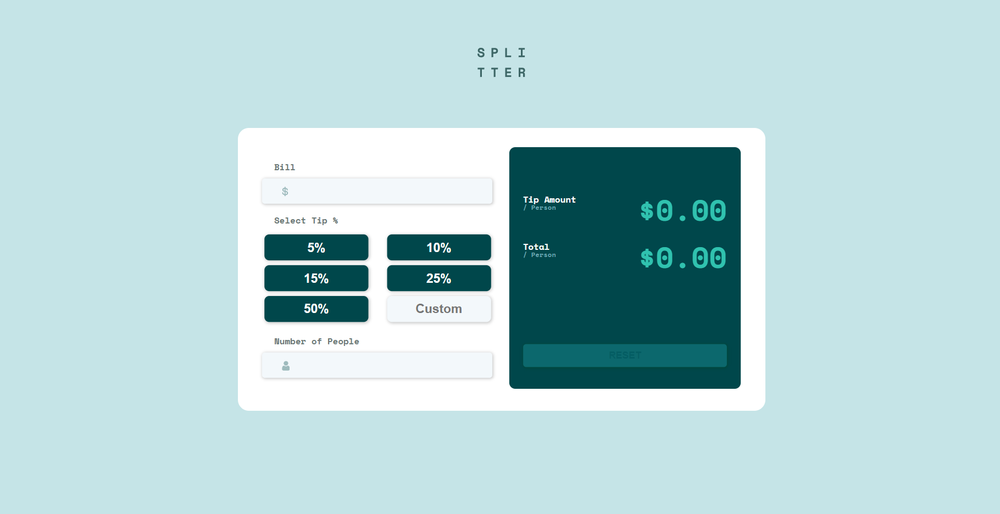
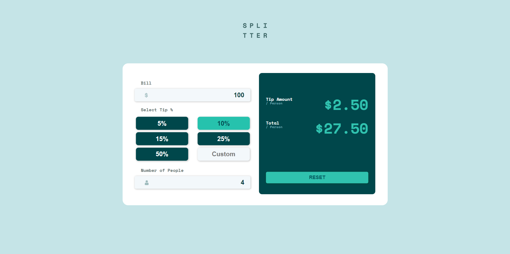
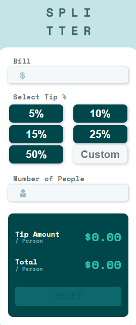
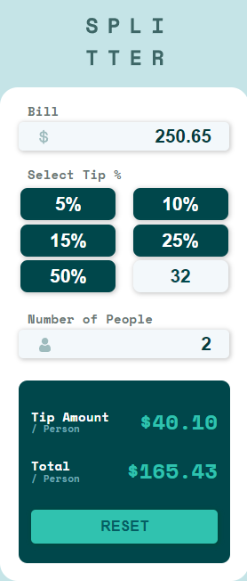

# Calculadora Customizada

Esta é uma solução para o desafio [Tip calculator app](https://www.frontendmentor.io/challenges/tip-calculator-app-ugJNGbJUX) do site [Front End Mentor](https://www.frontendmentor.io/challenges), onde você escontra diversos desafios que vão te ajudar a melhorar na área do Front-End.

## Sumário

- [Resumo](#Resumo)
  - [Desafio](#Desafio)
  - [Screenshot](#screenshot)
  - [Link](#link)
- [Processo](#Processo)
  - [Construido com](#construido-com)
  - [O que eu aprendi](#o-que-eu-aprendi)
- [Autor](#autor)

## Resumo

O desafio é construir o projeto e deixá-lo o mais próximo possível do design oferecido. Podendo usar qualquer ferramenta para ajudar a concluir o desafio. O objetivo é desenvolver uma calculadora de gorjetas onde o úsuario insere o valor do pedido, a porcentagem da gorjeta e a quantidade de pessoas que irá pagar, assim o programa pega todas as informção e disponibiliza pro úsuario o valor da gorjeta por pessoa e o valor total por pessoa. 


### Desafio

O site deveria ter uma boa usabilidade, um design fiel ao oferecido, e oferecer uma boa expêriencia ao usuário, vou destacar aqui alguns pontos importantes do desenvolvimento:


-Design Responsivo<br>
-Inputs para inserir informações<br>
-Botões para selecionar informações<br>
-Lógica de calculo<br>
-Exibir o resultado na tela<br>


### Screenshots

<p align="center"> Página inicial 
    </img>
</p>

------
<p align="center"> Página inicial em funcionamento
    </img>
</p>

------
<p align="center"> Página inicial responsiva
    </img>
</p>

------
<p align="center"> Página inicial responsiva em funcionamento
    </img>
</p>


### Link: https://nicolasgabriiel.github.io/Calculadora-Customizada/

## Processo

### Construido com

-HTML5 <br>
-CSS3 <br>
-JavaScript <br>

### Principais coisas que aprendi


 Retira a funcionalidade do type number 

```css
input::-webkit-outer-spin-button, input::-webkit-inner-spin-button {
    -webkit-appearance: none;
    margin: 0;
}
```

Usando o parseFloat pra transformar o elemento em numeros com casas decimais

```js
parseFloat(element)
```

Utilizando Arrow Functions
```js
(element) => {}
```

Utilizando o toFixed pra deixar o número sempre com duas casas decimais
```js
element.toFixed(2)
```

Utilizando o addEventListener 'input'
```js
inputPerson.addEventListener('input', () => {})
```


## Autor

-  Site pessoal - [Nicolas Gabriel](https://www.linkedin.com/in/nicolasgabriiel/)

<div  align="center">

### Planejamento do Projeto:

</div>


- [X] Estrutuar Header
- [X] Customizar Header e Background
- [X] Importar Fonte
- [X] Estrutuar bill
- [x] Customizar bill
- [x] Estrutuar select tip
- [x] Customizar select tip
- [x] Estrutuar number people
- [x] Customizar number people
- [x] Estrutuar total
- [x] Customizar total
- [x] Favicon e titulo
- [X] Remover aba do input
- [x] Receber os inputs da section one
- [x] Receber buttons da section two
- [x] Criar Lógica pra aplicar aparencia
- [x] Criar Lógica pra remover a aparência
- [x] Receber o custon da section two
- [x] Receber os inputs da section three
- [x] Criar Lógica do Resultado
- [x] Adicionar Resultado na tela
- [x] Recebendo elemento reset
- [x] Criando a Lógica Reset
- [x] Melhorar toda a lógica da calculadora
- [x] Verificador do reset
- [x] Aplicar o responsivo para telas maiores